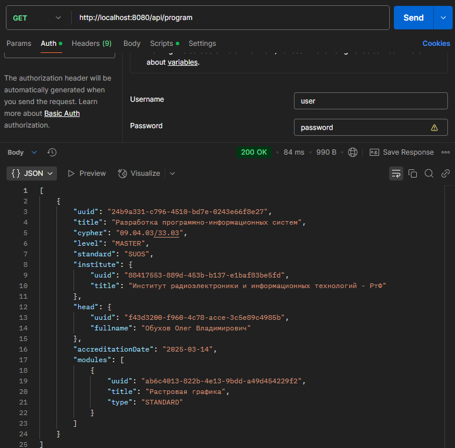
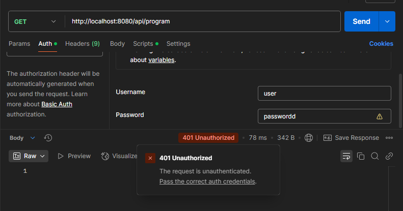
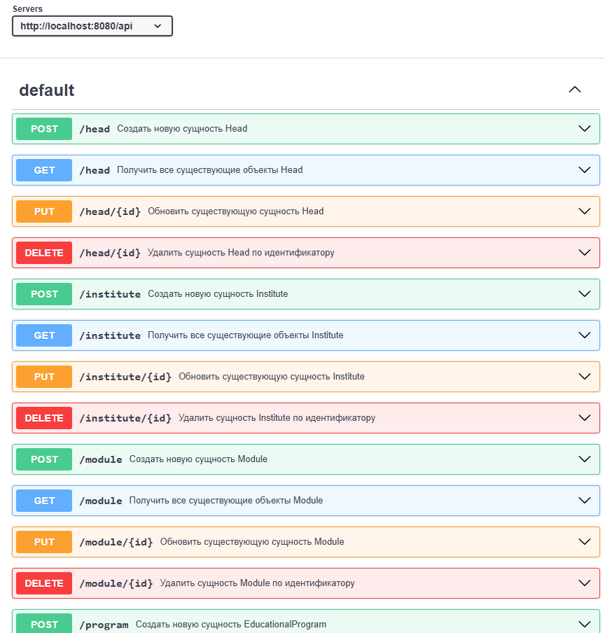
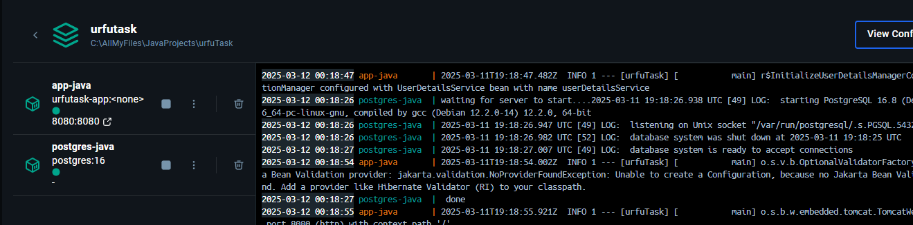

## Urfu Task

### Stack: Java Spring, PostgreSQL, Docker

--------

## Примеры запросов:
### ***1)Get http://localhost:8080/api/program***

### ***2)Post с существующим именем:***

### ***3)Get с добавлением BasicAuth:***

### ***3.2)Get с добавлением BasicAuth(неверный пароль):***

--------

## Swagger:

--------
## Docker работает:

-----

